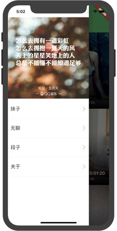

# flutter_jiandan

基于Google Flutter的高仿煎蛋客户端，支持Android和iOS。




## Android 扫码下载APK


## 使用
```bash
# 1. 通过模拟器菜单中的 Hardware > Device 选项检查当前模拟器是否是 64 位机型（iPhone 5S 或之后的机型）。
# 2. 根据你当前开发机器的屏幕尺寸，模拟器模拟出来的高密度屏幕的设备可能会占满你的屏幕，你可以通过菜单中的 Window > Scale 选项来更改模拟器的缩放比例。
open -a Simulator

# 检查本地环境
flutter doctor

# 运行
flutter run

# 来确保 Flutter 能够识别出你所连接的 Android 设备。
flutter devices

# Profile 模式，在 profile 模式下，一些调试能力是被保留的—足够分析你的 app 性能。
flutter run --profile

# Release
flutter run --release

flutter build apk
flutter build ios
```

## Getting Started

For help getting started with Flutter, view our online
- [documentation](https://flutter.dev).
- [flutter-io.cn](https://flutter-io.cn/).
- [dart](https://dart.dev/)
- [material](https://material-io.cn/design/)
